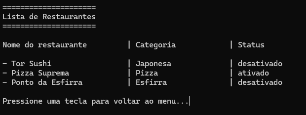

# 🍽️ Sistema de Gerenciamento de Restaurantes

Um aplicativo simples em **Python** para gerenciar restaurantes via terminal.  
Permite cadastrar, listar, ativar/desativar e deletar restaurantes de forma prática e interativa.

---

## 🖥️ Menu Principal

O programa exibe um menu estilizado com opções numeradas para fácil navegação:


---

## 📋 Lista de Restaurantes

Quando o usuário escolhe a opção de listar, o sistema exibe todos os restaurantes cadastrados, mostrando:
- Nome
- Categoria
- Status (ativado ou desativado)



---

## 🔁 Alternar Status
Permite ativar ou desativar um restaurante já cadastrado.

- Quando o restaurante está ativado, ele aparece como disponível no sistema.
- Quando está desativado, ele permanece cadastrado, mas é marcado como inativo.


---

## ⚙️ Funcionalidades

✅ **Cadastrar Restaurante**  
Adiciona um novo restaurante, com validação de nome e categoria.

✅ **Listar Restaurantes**  
Mostra todos os restaurantes cadastrados de forma formatada em colunas.

✅ **Alternar Estado**  
Permite ativar ou desativar restaurantes (por exemplo, abrir ou fechar um restaurante).

✅ **Deletar Restaurante**  
Remove permanentemente um restaurante cadastrado.

✅ **Sair**  
Finaliza o programa de forma segura.

---

## 🚀 Como Executar

1. **Clone o repositório:**
   ```bash
   git clone https://github.com/zotfps/gestao-restaurantes.git
